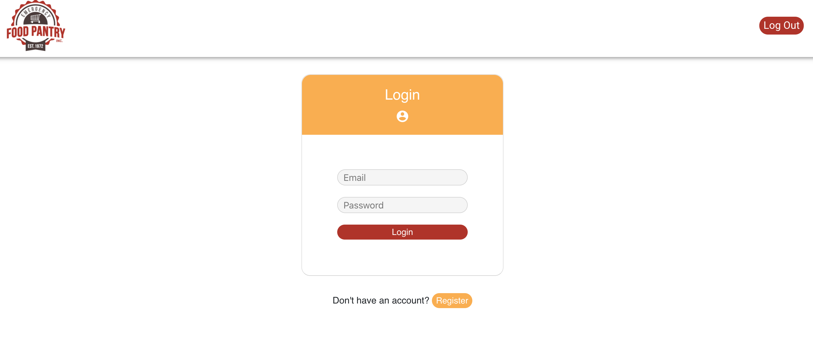
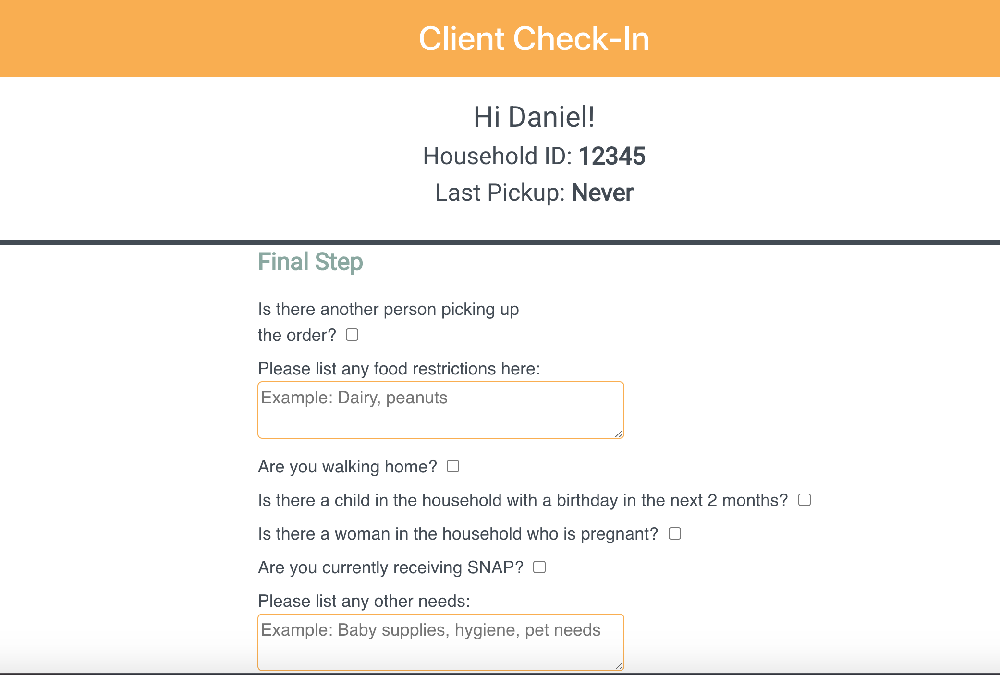
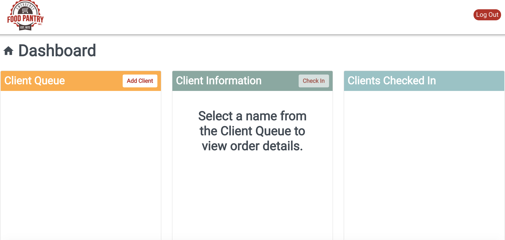
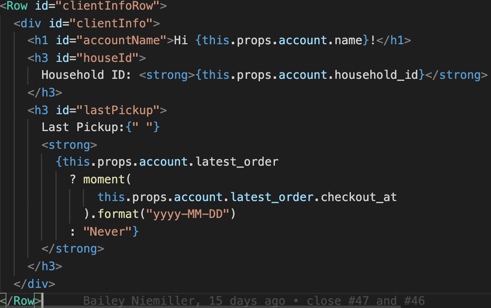
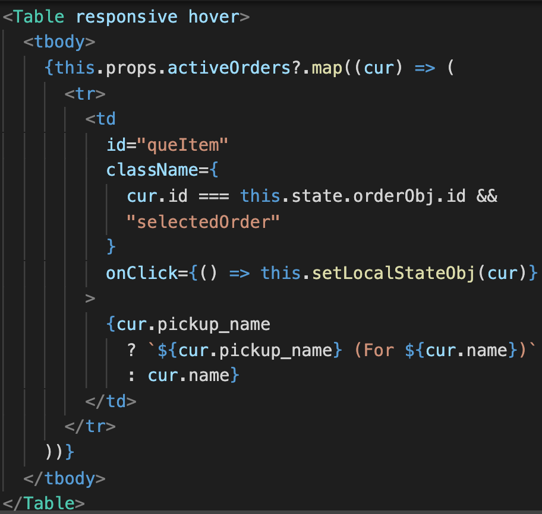

# Emergency Food Pantry Check-In

## Description

Duration: 2 Week Sprint

This project is for a simple checkin App that allows clients to register for monthly food pickups at the Emergency Food Pantry and fill in their information like food allergies, where they are parked, etc and the staff can serve them without much physical contact between the two parties.

To see the fully functional site, please visit:

## Demo
These are the screenshots for the demo app
Login

Checkin

DashBoard

## Prerequisites

Link to software that is required to install the app (e.g. node):

-[Node.js](https://nodejs.org/en/) -[Material UI](https://material-ui.com) -[Postgres](https://www.postgresql.org/download/) -[React-Bootstrap](https://react-bootstrap.github.io/getting-started/introduction)

## Installation
Requirements
For development, you will only need Node.js installed on your environement. And please use the appropriate Editorconfig plugin for your Editor (not mandatory).

## INSTALL
1. Create a database named your_database_name,
The queries in the tables.sql file are set up to create all the necessary tables and populate the needed data to allow the application to run correctly. The project is built on Postgres, so you will need to make sure to have that installed. We recommend using Postico to run those queries as that was used to create the queries,
2. Open up your editor of choice and run an npm install
3. Run npm run server in your terminal
4. Run npm run client in your terminal
The npm run client command will open up a new browser tab for you!

## Usage
1. When client arrives at location they login into their account
2. They then proceed to input their information like parking spot, allergies, etc,.
3. They complete sign in and staff can confirm that they are checked in on their end.
4. They can proceed to logout while they wait and once food is delivered to them, a staff member puts their name on the completed order pickup list.

## Code Samples

### Node

Node is really easy to install & now include NPM. You should be able to run the following command after the installation procedure.

$ node --version  :v14.4.0'

$ npm --version  :6.14.5

## Built With

-React.js -Node.JS -Redux -Redux Saga -Material UI -Postgres SQL -Axios -React-Bootstrap -Passport -Supertests -Moment

## License

[MIT](https://choosealicense.com/licenses/mit/)

## Acknowledgement

Thanks to [Emerging Digital Academy](https://www.emergingacademy.org/course/fullstack) in Fargo ND who equipped and helped us to make this application a reality.

# Contributors 
Ian Johnson, Bailey Niemiller, Luke Johnson, & Daniel Simango.